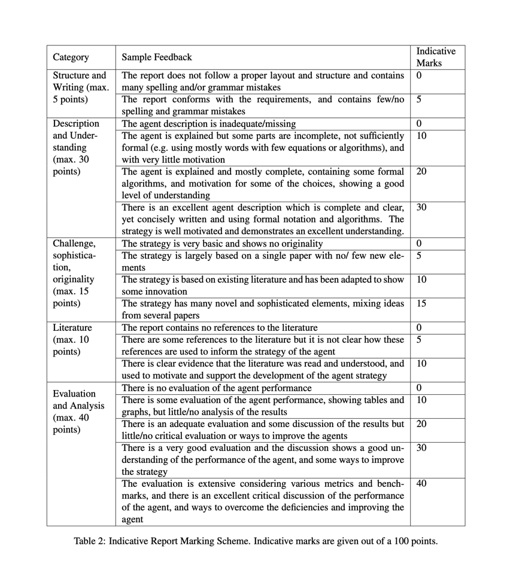

# Group17
## 前四个测试domain失败，需要反思

### 反思
整个项目时间太紧了，需要加强项目管理进程。在前三天还在改关键性的建模算法，让步和出价策略可以说是一点都没弄。
在代码测试和性能调优方面工作欠缺

## 报告需要重视起来

这是基本的评分标准，我总结一下就是：

1. 我们要设计一个测试验证方法
2. 我们要注意引用和引文质量
3. 我们需要方法设计的初衷和动机是什么
4. 我们需要设计一个混合两种模型的方法

以上都是我们还没有做得，尤其是出价策略这里，因为现在Mini League都已经关闭了，
所以我们要自己设计一个tournament去测试我们的模型效果。

在动机方面，必须要摆出我们的证据链，比如：由a和b得到c,比之前的d方法在c评价指标下更好，
必须要很精细。

## 报告的要求

- 最多包含2500个字符，不统计表格，图片，文献引用以及附录。
- 整个文章最多只能有6页，这个页面包含所有内容
- 超出的页面会有处罚

### 报告应该包含的内容为
- 对于整个代理决策的描述，包含(让步策略，出价策略，如何处理自身偏好不确定，以及接受报价策略)
`这里我们可能有大问题，让步策略，出价策略好像都没有好好写，自身偏好不确定，我们有那个两种建模方式可以重点说说，对于报价如何接受策略，我们也没有`
- 我们设计第一点的原因是什么，我们如何对于之前的方法进行比较，在这个方面，我们要正确地进行文献引用
`这里由于我们第一点的确实，所以在让步或者报价策略上面，我们没有参考太多相关文献，这里的工作缺失`
- 要设计一个评价代理性能指标的方法，建立于我们选择的评价方式，以及我们和其他代理在进行对比实验的结果
`这里我们要设计一些列对比实验，然后把结果使用数据分析的方法来评估，这里需要很多工作，规则怎么定，怎么设计对比实验，评价性能的指标要怎么计算，我们都需要设计和考虑`
- 对于我们设计代理的缺陷分析，以及如何改进我们的代理
- 对于所有团队成员贡献比例的陈述

### 得分要点
1. 符合上所说的所有要点，没有语法和语句错误
2. 对于整个代理的策略和方法有极好的描述，简洁，良好的符号标记，对于策略有良好的动机和理解。
3. 整个策略有许多新奇的要素，同时我们融合一些方法和文献。
4. 对于文献引用，我们展现了良好的理解，并且能够支持我们改进的动机
5. 我们的测评方法很科学合理，有多重评价方式融合，对比了很多现有的模型。同时我们对于我们算法的不足有很好的讨论，探索出各种解决问题的方法。

要求的原件在report文件夹里，这个报告值25%，大家要努力啊