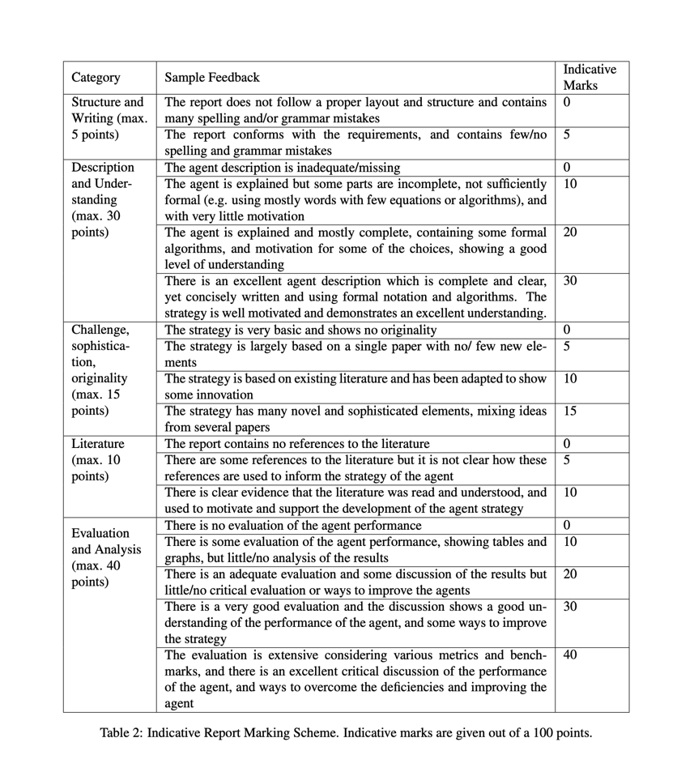

# 前四个测试domain失败，需要反思

## 反思
整个项目时间太紧了，需要加强项目管理进程。在前三天还在改关键性的建模算法，让步和出价策略可以说是一点都没弄。
在代码测试和性能调优方面工作欠缺

# 报告需要重视起来

这是基本的评分标准，我总结一下就是：

1. 我们要设计一个测试验证方法
2. 我们要注意引用和引文质量
3. 我们需要方法设计的初衷和动机是什么
4. 我们需要设计一个混合两种模型的方法

以上都是我们还没有做得，尤其是出价策略这里，因为现在Mini League都已经关闭了，
所以我们要自己设计一个tournament去测试我们的模型效果。

在动机方面，必须要摆出我们的证据链，比如：由a和b得到c,比之前的d方法在c评价指标下更好，
必须要很精细。
